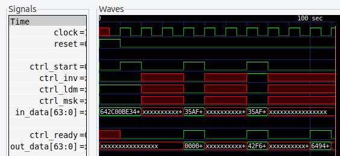

# SAG4Fun - An Open Source Sheep-And-Goats (SAG) and Inverse SAG Verilog IP

This core implements four bit manipulation instructions: SAG, ISG, EXT, DEP.
All of those instructions receive a data word in their first operand, and a bit
mask in the second operand.

The file [sag4fun.v](sag4fun.v) provides implementations for 32 and 64 bits:

| Verilog Module | Description                                  |
|:-------------- |:-------------------------------------------- |
| SAG4Fun32C     | 32-Bit combinatorial logic                   |
| SAG4Fun32S     | 32-Bit 5-step sequential core                |
| SAG4Fun64C     | 64-Bit combinatorial logic                   |
| SAG4Fun64S     | 64-Bit 6-step sequential core                |
| SAG4Fun64F     | 64-Bit 3-step sequential core                |

## Description of the SAG, ISG, EXT, and DEP Operation

Extract (EXT) and Deposit (DEP) are equivalent to the [x86 PEXT and PDEP
instructions](https://en.wikipedia.org/wiki/X86_Bit_manipulation_instruction_set#Parallel_bit_deposit_and_extract).
Hacker's Delight calls EXT "compress" and DEP "expand".

The EXT (or "compress") instructions takes the data bits selected by the 1 bits
in the mask operand, and places them in at the right (LSB) end of the output
word, filling the remaining MSB bits with zeros.

The DEP (or "expand") instruction performs the opposite operation: it takes as
many data bits from the LSB end of the data operand, and places them in the
locations selected by 1 bits in the mask operand. The remaining output bits are
set to zero.

The Sheep-And-Goats (SAG) instruction performs a similar operation as EXT, but
instead of leaving the MSB bits at zero, this instruction takes the remaining
data bits and places them in the MSB bits of the output, in reversed order.

The Inverse Sheep-And-Goats (ISG) instruction is the inverse of the SAG
instruction. It places the LSB data bits in the 1 positions in the mask,
and places the remaining data bits in the remaining output positions, in
reversed order.

## Variants without reversed order of "goat" bits

A variant of the Sheep-And-Goats (SAG) instruction that does not reverse the
order of the unmarked data bits is significantly harder to implement in hardware,
and is thus best emulated using the following sequence of three instructions:

```
sag rd, rs1, rs2
sag rt, rs2, rs2
sag rd, rd, rt
```

(`rs1` and `rs2` are the data and mask operand, `rd` is the destination register, and
`rt` is a temporary register.)

Similarly, the Inverse Sheep-And-Goats instruction without revsed order of the
unmarked data bits:

```
sag rd, rs2, rs2
sag rd, rs1, rd
isg rd, rd, rs2
```

## Verilog Core Interface

The combinatorial cores SAG4Fun32C and SAG4Fun64C have the following interface:

| Port                      | Description                           |
|:------------------------- |:------------------------------------- |
| `input ctrl_inv`          | Set to 1 for ISG and DEP, 0 otherwise |
| `input ctrl_msk`          | Set to 1 for EXT and DEP, 0 otherwise |
| `input [N-1:0] in_data`   | The data operand (32 or 64 bits wide) |
| `input [N-1:0] in_mask`   | The mask operand (32 or 64 bits wide) |
| `output [N-1:0] out_data` | The result                            |

The sequential cores have only one data input and provide a "load mask" mode
for loading a new mask. Loading a mask requires the same number of cycles
as processing a data word (5, 6, or 3 cycles for SAG4Fun32S, SAG4Fun64S,
and SAG4Fun64F respectively).

| Port                      | Description                               |
|:------------------------- |:----------------------------------------- |
| `input clock`             | The (positive edge) clock                 |
| `input reset`             | The (high-active, synchronous) reset      |
| `input ctrl_start`        | Start a new operation (abort current one) |
| `output ctrl_ready`       | Signal that last operation finished       |
| `input ctrl_inv`          | Set to 1 for ISG and DEP, 0 otherwise     |
| `input ctrl_msk`          | Set to 1 for EXT and DEP, 0 otherwise     |
| `input ctrl_ldm`          | Set to 1 for loading a new mask           |
| `input [N-1:0] in_data`   | The data input (32 or 64 bits wide)       |
| `output [N-1:0] out_data` | The result (valid when `ctrl_ready` is 1) |

The control inputs `ctrl_inv` and `ctrl_msk` should be set to 0 in `ctrl_ldm`
mode.


